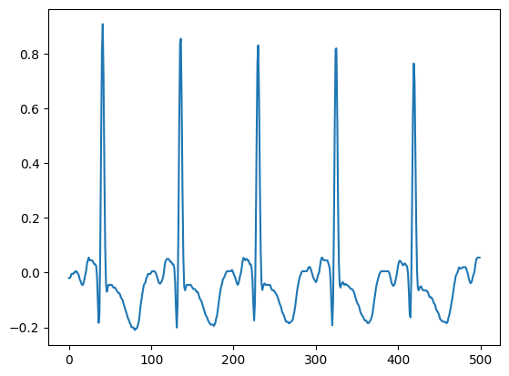

# To document all the use cases and issue with WFDB

### Using wfdb.rdsamp()

- need to remove the file type extension (.dat, .hea) seems to auto detect for .dat and .hea

```
data_dir = "../data/infant1_ecg"
infant1_ecg_record = wfdb.rdsamp(f"{data_dir}")
plt.plot(infant1_ecg_record[0][:500])
```

</img>

<!--  -->
